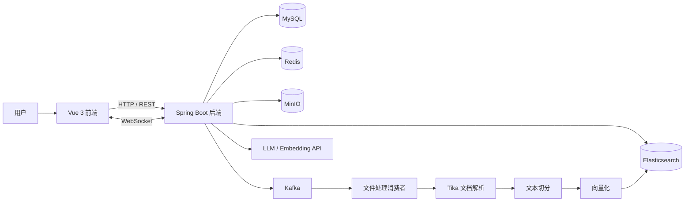

# 企业知识中枢 | 面向企业的私有知识库 RAG 智能问答系统

> 面向企业制度、流程规范、项目资料、客户方案和内部知识资产，打造集知识文件管理、权限隔离、混合检索、RAG 大模型问答于一体的私有知识库平台，支持员工通过自然语言与企业知识库进行安全、高效的交互。

<p align="center">
  
  
  
  
  
  
</p>

<p align="center">
  
</p>
<p align="center">项目运行后的企业知识库问答工作台</p>

## 项目背景

这是一个面向企业内部知识管理场景的私有知识库系统，核心目标不是做一个简单的聊天 Demo，而是把分散在制度文件、流程规范、项目文档、客户方案、培训资料和业务报告中的知识沉淀成一个可上传、可管理、可按权限检索、可多轮问答的知识平台。

在企业知识管理场景下，传统检索和人工查找方式往往存在几个问题：

- 企业资料分散在多个系统和个人目录中，知识沉淀与复用成本高。
- 单纯关键词检索命中有限，难以理解复杂业务问题和上下文表达。
- 内部资料涉及部门、项目和岗位权限，需要严格的访问隔离。
- 员工真正需要的是“基于企业可信资料给出答案”，而不是脱离业务语料的泛化回答。

这个项目围绕这些痛点，打通了知识文件上传、解析切分、向量化入库、混合检索、Prompt 增强、多轮问答和权限控制的完整闭环，让企业内部知识可以被安全检索、准确问答和持续复用。

## 项目概览

| 维度 | 内容 |
| --- | --- |
| 项目类型 | 私有知识库平台 |
| 应用场景 | 企业制度、流程规范、项目资料、客户方案、内部培训资料问答 |
| 核心能力 | 知识资产管理、混合检索、RAG 问答、权限隔离、多轮对话 |
| 后端技术 | Spring Boot、MySQL、Redis、Apache Tika、Elasticsearch、MinIO、Kafka、Spring Security、WebSocket |
| 前端技术 | Vue 3、TypeScript、Vite、Pinia、Naive UI |
| 模型接入 | OpenAI 兼容接口（Ollama / vLLM 等） |

| 文档 | 说明 |
| --- | --- |
| [docs/操作手册.md](./docs/操作手册.md) | **新手安装部署全流程**（推荐先看） |
| [docs/手工启动指南.md](./docs/手工启动指南.md) | 日常手工启动速查 |
| [docs/企业能力落地说明.md](./docs/企业能力落地说明.md) | 审计、权限、表格、监控 |
| [docs/需求文档.md](./docs/需求文档.md) | 功能需求、验收标准与排障索引 |

## 核心能力

| 模块 | 说明 |
| --- | --- |
| 用户与权限 | 基于 Spring Security + JWT 做认证鉴权，支持普通用户与管理员角色控制 |
| 知识文件上传 | 支持大文件分片上传、状态查询、断点续传和文件合并 |
| 知识文件存储 | 上传文件落到 MinIO，对象地址进入后续异步处理链路 |
| 文档解析 | 基于 Apache Tika 提取 PDF / Word / TXT 等文档正文内容 |
| 文本切分 | 对解析文本进行分块，便于后续向量化和检索召回 |
| 向量索引 | 调用 Embedding 接口生成向量，写入 Elasticsearch |
| 混合检索 | 结合关键词匹配与向量召回完成 RAG 检索 |
| 智能问答 | 基于检索结果构建上下文，使用 WebSocket 输出流式回答 |
| 多轮对话 | Redis 保存 conversationId 和最近对话历史，支持连续追问 |
| 管理能力 | 支持知识库文件管理、用户管理、组织标签与企业级权限控制 |


## 系统架构



## 业务流程

1. 用户登录系统后进入知识库页面，上传企业内部知识文件。
2. 前端将大文件按分片上传，后端记录分片状态并支持断点续传。
3. 文件合并成功后保存到 MinIO，并将处理任务发送到 Kafka。
4. Kafka 消费者异步拉取文档，使用 Tika 解析正文内容。
5. 文本被切分为可检索的知识块，再调用 Embedding 接口生成向量。
6. 向量与文本一起写入 Elasticsearch，形成可检索知识索引。
7. 用户提问时，系统执行混合检索，按权限过滤可访问文档。
8. 检索结果被拼接成增强上下文，送入模型生成回答。
9. 回答通过 WebSocket 流式返回，聊天历史由 Redis 维护。

## 技术栈

| 层级 | 技术 |
| --- | --- |
| 前端 | Vue 3、TypeScript、Vite、Pinia、Naive UI、UnoCSS |
| 后端 | Java 17、Spring Boot 3、Spring Security、Spring Data JPA、WebFlux、WebSocket |
| 检索与 AI | Elasticsearch、Embedding API、LLM Chat API、Ollama 兼容接口 |
| 中间件 | Redis、Kafka、MinIO |
| 数据层 | MySQL 8 |
| 文档处理 | Apache Tika、HanLP |
| 工程化 | Maven、pnpm、Docker Compose |


## 快速启动

> 第一次部署请直接阅读 **[安装部署操作手册](./docs/操作手册.md)**，内含 Docker、vLLM 双服务、验收与踩坑说明。

### 1. 环境要求

| 工具 | 版本建议 |
| --- | --- |
| JDK | 17 |
| Maven | 3.9+ |
| Node.js | 18.20+ |
| pnpm | 8.7+ |
| Docker | 最新稳定版 |

### 2. 启动基础设施

项目已提供基础设施编排文件：

```bash
docker compose -f docs/docker-compose.yaml up -d
```

默认会启动以下服务：

- MySQL
- Redis
- MinIO
- Kafka
- Elasticsearch

### 3. 配置模型服务

项目通过 **OpenAI 兼容接口** 接入模型。本地推荐 **vLLM 双实例**（对话与向量分离）：

| 能力 | 默认地址 | 说明 |
| --- | --- | --- |
| 对话 LLM | `http://127.0.0.1:8000/v1` | 如 Qwen3.6-35B-A3B，路径 `/chat/completions` |
| 向量 Embedding | `http://127.0.0.1:8001/v1` | **bge-m3**，路径 `/embeddings`（勿与对话共用 8000） |

Embedding 示例（需与 `embedding.api.dimension: 1024`、ES 索引 `vector.dims` 一致）：

```bash
vllm serve /path/to/bge-m3 --runner pooling --convert embed \
  --host 127.0.0.1 --port 8001 --api-key vllm_api_key_12345 \
  --served-model-name bge-m3 --gpu-memory-utilization 0.04
```

也可改用 Ollama（`http://localhost:11434/v1`），须保证向量维度与 ES 映射一致。

在 [src/main/resources/application.yml](./src/main/resources/application.yml) 中修改：

- `deepseek.api.*` — 对话模型
- `embedding.api.*` — 向量模型（含 `dimension: 1024`）
- `rag.pipeline.*` — 本地开发建议关闭 query-rewrite / hyde / reflection，避免问答前等待数分钟

**注意**：MinIO 需存在桶 `uploads`（应用启动时会自动创建）；上传后需等待 Kafka 异步索引完成再检索。

### 4. 启动后端

```bash
mvn spring-boot:run
```

后端默认端口：

- `http://localhost:8081`

### 5. 启动前端

```bash
cd frontend
pnpm install
pnpm dev
```

前端默认端口：

- `http://localhost:9527`

### 6. 默认账号

系统启动后会自动初始化管理员账号：

- 用户名：`admin`
- 密码：`admin123`

## 本地开发端口

| 服务 | 地址 |
| --- | --- |
| Frontend | `http://localhost:9527` |
| Backend | `http://localhost:8081` |
| MySQL | `localhost:3307` |
| Redis | `localhost:6379` |
| MinIO API | `http://localhost:19000` |
| MinIO Console | `http://localhost:19001` |
| Kafka | `localhost:9092` |
| Elasticsearch | `http://localhost:9200` |

## 常见问题

| 现象 | 处理 |
| --- | --- |
| 已上传文件但问答/检索无结果 | 检查 `curl -u elastic:PaiSmart2025 http://localhost:9200/knowledge_base/_count` 是否为 0；查看日志是否有向量维度 768/1024 不匹配或 `bulkIndex` 失败，重启后端会自动校验 ES 维度并重建索引 |
| 上传报 MinIO NoSuchBucket | 确认 MinIO 已启动；桶名 `uploads` 与 `application.yml` 中 `minio.bucketName` 一致 |
| 问答响应很慢 | 将 `rag.pipeline` 下 `enable-query-rewrite`、`enable-hyde`、`enable-reflection` 设为 `false` |

更多说明见 [docs/需求文档.md](./docs/需求文档.md#9-运维与排障)。
