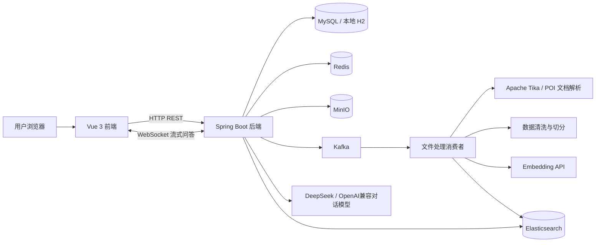
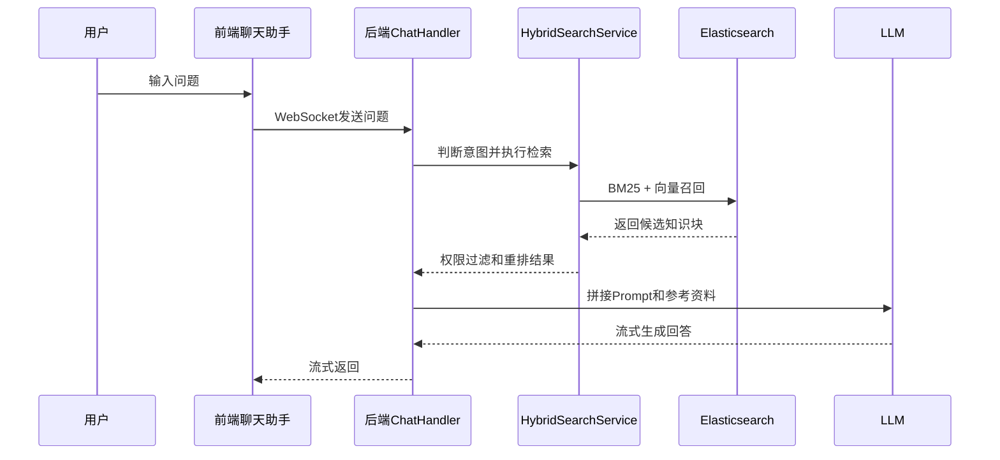

# 龙汇QA技术文档

## 1. 项目定位

龙汇QA是面向企业内部知识资产的私有知识库问答系统。系统围绕“文件上传、权限隔离、数据清洗、知识分类、异步索引、混合检索、RAG问答、运行监控”构建，目标是让企业制度、流程文档、培训资料、项目资料等内容可以被安全检索和自然语言问答。

系统不是单纯的大模型聊天页面，而是一套完整的知识处理链路：



## 2. 总体架构

| 层级 | 主要技术 | 作用 |
| --- | --- | --- |
| 前端层 | Vue 3、TypeScript、Vite、Pinia、Naive UI、UnoCSS | 提供登录、知识资产、聊天助手、用户管理、权限配置、运行监控等页面 |
| 接口层 | Spring Boot Web、Spring Security、JWT、WebSocket | 提供REST接口、认证鉴权、问答流式输出 |
| 业务层 | Spring Service、JPA Repository、权限服务、清洗服务、检索服务 | 承载上传、分类、清洗、权限判断、RAG检索和问答编排 |
| 存储层 | MySQL、本地H2、Redis、MinIO、Elasticsearch | 保存业务元数据、会话状态、原始文件、检索索引 |
| 异步层 | Kafka、Spring Kafka | 文件合并后异步解析、清洗、向量化和索引，避免上传接口长时间阻塞 |
| AI层 | DeepSeek Chat API、OpenAI兼容Embedding API、vLLM/Ollama兼容接口 | 生成回答和文本向量 |
| 运维层 | Spring Actuator、运行监控接口、本地状态脚本 | 检查后端、中间件、模型、Kafka积压和上传能力 |

## 3. 后端技术选型

### 3.1 Java 17

项目使用Java 17作为运行版本。原因是Spring Boot 3.x要求Java 17起步，同时Java 17是长期支持版本，适合企业项目长期维护。

需要注意：本机编译时不要使用过高版本JDK。当前项目的Lombok版本与Java 26不兼容，推荐固定使用JDK 17。

### 3.2 Spring Boot 3.4

Spring Boot负责应用启动、配置管理、依赖注入、Web接口、事务、数据访问、健康检查等基础能力。选择它的原因：

- 企业Java生态成熟，适合多人维护。
- 与Spring Security、Spring Data JPA、Spring Kafka、Actuator集成成本低。
- 配置清晰，适合区分正式环境、本地环境、Docker环境。

### 3.3 Spring MVC REST接口

系统多数业务使用REST接口，例如用户登录、文件上传、知识资产列表、分类管理、清洗规则、运行监控、用户管理等。REST接口适合表单提交、列表查询、权限配置和后台管理。

典型接口包括：

| 模块 | 路径前缀 | 用途 |
| --- | --- | --- |
| 用户 | `/api/v1/users` | 登录、当前用户、修改密码、用户组织信息 |
| 上传 | `/api/v1/upload` | 上传预检、分片上传、状态查询、合并、支持格式 |
| 文档 | `/api/v1/documents` | 可访问文档、预览、下载、删除、重清洗、重索引 |
| 知识分类 | `/api/v1/knowledge-categories` | 分类列表与创建 |
| 管理 | `/api/v1/admin` | 用户管理、角色文件权限、审计、运行监控 |

### 3.4 WebSocket

聊天助手使用WebSocket输出模型回答。选择WebSocket的原因：

- 大模型回答可能较长，流式返回体验更好。
- 可以在同一连接内持续输出回答片段。
- 比轮询更适合实时对话体验。

### 3.5 Spring Security + JWT

系统使用Spring Security做接口鉴权，JWT用于登录态传递。选择原因：

- 后端接口可以统一校验身份和角色。
- 前端只需要携带Token访问接口。
- 后续接入单点登录、企业微信、LDAP时扩展空间较好。

当前角色体系包括：

| 角色 | 定位 |
| --- | --- |
| `DEPT_MEMBER` | 部门成员，只能访问有权限的公共知识和本部门知识 |
| `DEPT_LEAD` | 部门负责人，可创建部门成员账号，可管理本部门知识 |
| `KNOWLEDGE_ADMIN` | 知识管理员，偏公共知识管理 |
| `SUPER_ADMIN` | 超级管理员，可管理所有用户、部门、文档和权限 |
| `ADMIN` | 兼容旧管理员角色，按超级管理员处理 |

### 3.6 Spring Data JPA

JPA用于管理用户、文件上传元数据、知识分类、清洗规则、角色文件权限等业务表。选择原因：

- 业务表结构变化较快，JPA能降低CRUD开发成本。
- `ddl-auto:update`便于本地开发阶段快速演进。
- Repository模式让查询逻辑集中，便于测试。

正式环境建议使用MySQL。本地开发当前使用文件型H2：

```yaml
spring:
  datasource:
    url: jdbc:h2:file:./data/PaiSmart;MODE=MySQL;DATABASE_TO_LOWER=TRUE;DB_CLOSE_DELAY=-1;DB_CLOSE_ON_EXIT=FALSE
```

这样本地后端重启后，上传记录和权限配置不会丢失。早期使用过`jdbc:h2:mem`，这是内存库，服务重启会清空数据。

### 3.7 MySQL

MySQL用于正式环境的数据持久化，保存：

- 用户账号、角色、组织标签。
- 文件上传记录和知识范围。
- 知识分类。
- 清洗规则。
- 文件索引状态。
- 审计日志和管理数据。

选择MySQL的原因是企业部署常见、运维成熟、事务支持可靠。

### 3.8 Redis

Redis主要用于会话、对话上下文、缓存和限流类状态。选择原因：

- 读写快，适合保存短期上下文。
- 可用于多轮对话历史。
- 后续可扩展Token黑名单、热点配置缓存、分布式锁等能力。

### 3.9 MinIO

MinIO用于保存上传的原始文件和合并后的文件对象。选择原因：

- S3兼容，后续迁移到云对象存储比较容易。
- 适合保存大文件，不适合把文件二进制直接塞进数据库。
- 与数据库分工清晰：数据库保存元数据，MinIO保存文件本体。

### 3.10 Kafka

Kafka用于文件处理异步化。上传合并完成后，后端只投递处理任务，真正的解析、清洗、向量化、索引由消费者完成。

选择Kafka的原因：

- 避免上传接口等待文档解析和大模型向量化。
- 文件处理失败后可以通过重试、DLT和重索引继续处理。
- 适合多人同时上传时削峰填谷。

### 3.11 Elasticsearch

Elasticsearch保存知识块文本和向量，用于混合检索。选择原因：

- 支持关键词检索，适合制度条款、编号、专有名词。
- 支持向量字段，适合语义召回。
- 可以同时保存权限字段，检索后按用户可见范围过滤。

当前Embedding维度为1024，ES索引映射也必须保持1024维。若更换向量模型，需要同步修改`embedding.api.dimension`并重建索引。

### 3.12 Apache Tika

Tika用于从PDF、Word、PPT、HTML、RTF、EPUB等文件中提取文本。选择原因：

- 支持格式广，适合企业内部复杂文档。
- 屏蔽不同文档格式的解析差异。
- 与Java后端集成方便。

### 3.13 Apache POI 和 Commons CSV

POI用于Excel、Word等Office文档解析，Commons CSV用于CSV结构化文本处理。选择原因：

- 表格类知识在企业知识库中很常见。
- CSV/Excel需要比普通文本更稳定的解析方式。
- 后续可扩展“表格问答”和“字段级检索”。

### 3.14 HanLP

HanLP用于中文文本处理。中文知识库里，分词、短语识别和文本切分质量会影响检索召回。选择HanLP是为了改善中文语义处理能力。

### 3.15 DeepSeek / OpenAI兼容模型接口

对话模型当前按OpenAI Chat Completions兼容协议接入，默认配置为DeepSeek云端模型，密钥通过环境变量注入。选择兼容协议的原因：

- 可以在DeepSeek、vLLM、Ollama、其他OpenAI兼容服务之间切换。
- 业务代码不强绑定某一家模型服务。
- 本地模型和云端模型都能接入。

Embedding服务当前默认走本机`http://127.0.0.1:8001/v1`，用于避免企业文档内容向外部服务发送。

## 4. 前端技术选型

### 4.1 Vue 3

Vue 3用于构建管理后台和知识库操作界面。选择原因：

- 响应式开发效率高。
- 适合中后台表单、表格、弹窗、状态管理。
- 与TypeScript配合后可维护性更好。

### 4.2 TypeScript

TypeScript用于约束接口数据、表格行、上传任务、角色权限等类型。选择原因：

- 减少接口字段变更导致的运行时错误。
- 权限、知识范围、文件状态等枚举适合类型约束。
- 多人协作时更容易理解数据结构。

### 4.3 Vite

Vite用于前端开发服务器和构建。选择原因：

- 本地启动快。
- 热更新体验好。
- Vue 3生态支持完善。

### 4.4 Pinia

Pinia用于保存用户信息、知识库列表、上传状态、清洗规则、分类等前端状态。选择原因：

- Vue官方推荐状态管理。
- 类型支持较好。
- 模块化 store 便于维护。

### 4.5 Naive UI

Naive UI提供表格、表单、按钮、弹窗、标签、上传等组件。选择原因：

- 中后台组件完整。
- TypeScript支持好。
- 风格克制，适合企业管理系统。

### 4.6 UnoCSS

UnoCSS用于原子化样式。选择原因：

- 快速调整布局和间距。
- 生成CSS体积小。
- 适合已有Soybean Admin风格项目。

## 5. 核心业务模块

### 5.1 用户与权限

系统关闭外部开放注册，账号由管理员或部门负责人创建：

- 超级管理员可以创建所有角色账号。
- 部门负责人可以创建本部门成员账号。
- 普通成员不能创建账号。

文件权限被拆成可配置动作：

| 权限动作 | 说明 |
| --- | --- |
| `VIEW` | 查看文件列表 |
| `PREVIEW` | 预览文件 |
| `DOWNLOAD` | 下载文件 |
| `UPLOAD_PUBLIC` | 上传公共知识 |
| `UPLOAD_DEPARTMENT` | 上传部门知识 |
| `DELETE` | 删除文件 |
| `RECLEAN` | 重新清洗 |
| `REINDEX` | 重新索引 |
| `RESUME_UPLOAD` | 续传中断上传 |

权限判断采用“默认规则 + 管理端角色覆盖”的方式。这样系统初始可用，同时超级管理员可以继续细化每个角色的文件增删改查权限。

### 5.2 公共知识和部门知识

知识范围分为：

| 范围 | 说明 |
| --- | --- |
| `PUBLIC` | 公共知识，面向全员可见，由知识管理员或超级管理员维护 |
| `DEPARTMENT` | 部门知识，仅本部门可见，由部门负责人维护 |
| `PRIVATE` | 个人知识预留范围，后续可扩展 |

检索和文件列表都会结合用户角色、组织标签、部门ID进行权限过滤，避免越权访问。

### 5.3 知识分类

知识分类用于给上传文档增加业务目录，例如制度、人事、财务、项目资料、培训资料等。分类可区分公共范围和部门范围。

设计目的：

- 让知识资产列表更容易管理。
- 提高用户上传时的归档质量。
- 后续可用于检索过滤、统计分析、自动试题生成范围选择。

### 5.4 数据清洗

数据清洗发生在文档解析之后、文本切分和向量化之前。当前清洗规则包括：

- 统一换行。
- 规范Unicode空白符。
- 压缩多余空格。
- 去掉行首行尾空白。
- 合并连续空行。
- 删除重复行。
- 使用正则删除页码、目录、分隔线等噪声。

清洗规则的意义：

- 减少PDF页眉页脚、目录、页码干扰。
- 提高向量质量。
- 降低模型引用无关内容的概率。
- 让同一份文档重清洗时可控。

### 5.5 文件上传和断点续传

前端按5MB分片上传，后端保存分片状态，合并后写入MinIO并记录数据库元数据。支持格式包括：

`pdf, doc, docx, xls, xlsx, ppt, pptx, txt, rtf, md, odt, ods, odp, html, htm, xml, json, csv, epub, pages, numbers, keynote`

上传大小默认限制为200MB，前端和后端需要保持一致。

### 5.6 异步索引

文件合并后会投递Kafka任务。消费者流程：

1. 从MinIO读取文件。
2. 解析文本。
3. 套用清洗规则。
4. 按父子块策略切分。
5. 调用Embedding接口生成向量。
6. 写入Elasticsearch。
7. 更新文件索引状态。

这样做的好处是上传体验更稳定，文件解析失败也能单独重试。

### 5.7 RAG问答

问答流程：



当前RAG策略包括：

- 常规问题可直接回答，例如“你是谁”。
- 企业内部制度、流程、数字类问题优先使用知识库检索结果。
- 无可靠知识库依据时，需要明确说明没有找到可靠依据。
- 来源信息在前端折叠展示，避免回答页面过于拥挤。

### 5.8 运行监控

运行监控页检查：

- Redis状态。
- MinIO状态。
- Elasticsearch状态和知识库索引数量。
- 对话模型状态。
- 向量模型状态。
- Kafka状态和积压。
- 上传限制和上传预检。

本地也可以使用：

```bash
./scripts/local-dev-status.sh
```

## 6. 配置说明

### 6.1 主要配置文件

| 文件 | 用途 |
| --- | --- |
| `src/main/resources/application.yml` | 默认配置，偏正式环境，使用MySQL、Redis、MinIO、Kafka、ES、模型API |
| `src/main/resources/application-local.yml` | 本地完整体验配置，使用文件型H2并简化部分认证 |
| `src/main/resources/application-docker.yml` | Docker环境配置 |
| `docs/docker-compose.yaml` | 本地或服务器中间件编排 |

### 6.2 模型配置

对话模型：

```yaml
deepseek:
  api:
    url: ${DEEPSEEK_API_URL:https://api.deepseek.com}
    model: ${DEEPSEEK_API_MODEL:deepseek-v4-flash}
    key: ${DEEPSEEK_API_KEY:}
```

向量模型：

```yaml
embedding:
  api:
    url: http://127.0.0.1:8001/v1
    key: vllm_api_key_12345
    model: bge-m3
    batch-size: 10
    dimension: 1024
```

注意：

- 对话模型和向量模型可以不是同一个服务。
- 企业文档向量化建议优先走本地Embedding。
- 更换Embedding模型时必须同步ES向量维度。

### 6.3 并发配置

面向20人同时使用，当前配置通过Tomcat线程池和问答并发限制保护系统：

```yaml
server:
  tomcat:
    threads:
      max: 80
      min-spare: 10
    accept-count: 100
    max-connections: 200

chat:
  concurrency:
    max-active: 8
    wait-timeout-ms: 3000
```

这样可以避免所有用户同时占用外部模型服务导致系统雪崩。

## 7. 数据持久化说明

| 数据 | 保存位置 | 是否重启保留 |
| --- | --- | --- |
| 用户、角色、文档元数据、分类、清洗规则 | MySQL或文件型H2 | 是 |
| 知识空间 | `knowledge_space`表 | 是 |
| 本地H2文件 | `./data/PaiSmart.mv.db` | 是 |
| 上传文件本体 | MinIO bucket `uploads` | 是 |
| 向量索引 | Elasticsearch `knowledge_base` | 是 |
| 对话短期上下文 | Redis | 视Redis持久化配置而定 |

不要再使用`jdbc:h2:mem`保存本地知识库数据，因为内存库会在后端重启后清空。

### 7.1 知识空间模型

知识库页面使用知识空间组织文档：

| 模型 | 作用 |
| --- | --- |
| `KnowledgeSpace` | 持久化公共知识库、部门知识库、个人知识库等空间 |
| `FileUpload.spaceId` | 新上传文件写入所属空间，同时保留`knowledgeScope`和`departmentId`兼容旧逻辑 |
| `KnowledgeSpaceService` | 汇总用户可访问文件，生成空间统计和缺失空间 |
| `/api/v1/documents/knowledge-spaces` | 返回当前用户可见空间的文件数、索引数、处理中数量、清洗异常数 |

聊天助手发送WebSocket消息时会携带当前知识空间上下文，后端在RAG检索结果进入提示词前按公共或部门空间过滤，避免引用不属于当前块的来源。

## 8. 测试与验证

后端常用验证：

```bash
JAVA_HOME=/opt/homebrew/opt/openjdk@17/libexec/openjdk.jdk/Contents/Home \
PATH=/opt/homebrew/opt/openjdk@17/bin:$PATH \
mvn -q -DskipTests package
```

前端类型检查：

```bash
cd frontend
./node_modules/.bin/vue-tsc --noEmit --skipLibCheck
```

本地服务检查：

```bash
./scripts/local-dev-status.sh
```

## 9. 后续扩展建议

| 方向 | 建议 |
| --- | --- |
| 历史文件恢复 | 从MinIO和ES反向补齐`file_upload`元数据，修复早期内存库丢失记录 |
| 试题生成 | 基于分类、文档、章节生成单选、多选、判断、简答题，并保存题库 |
| 精细权限 | 增加文档级授权、分类级授权、下载水印和审计 |
| 检索质量 | 加入reranker模型、表格结构化检索、引用片段定位 |
| 企业集成 | 接入LDAP、企业微信、钉钉、统一身份认证 |
| 运维部署 | 引入Nginx、HTTPS、备份策略、日志采集和告警 |
