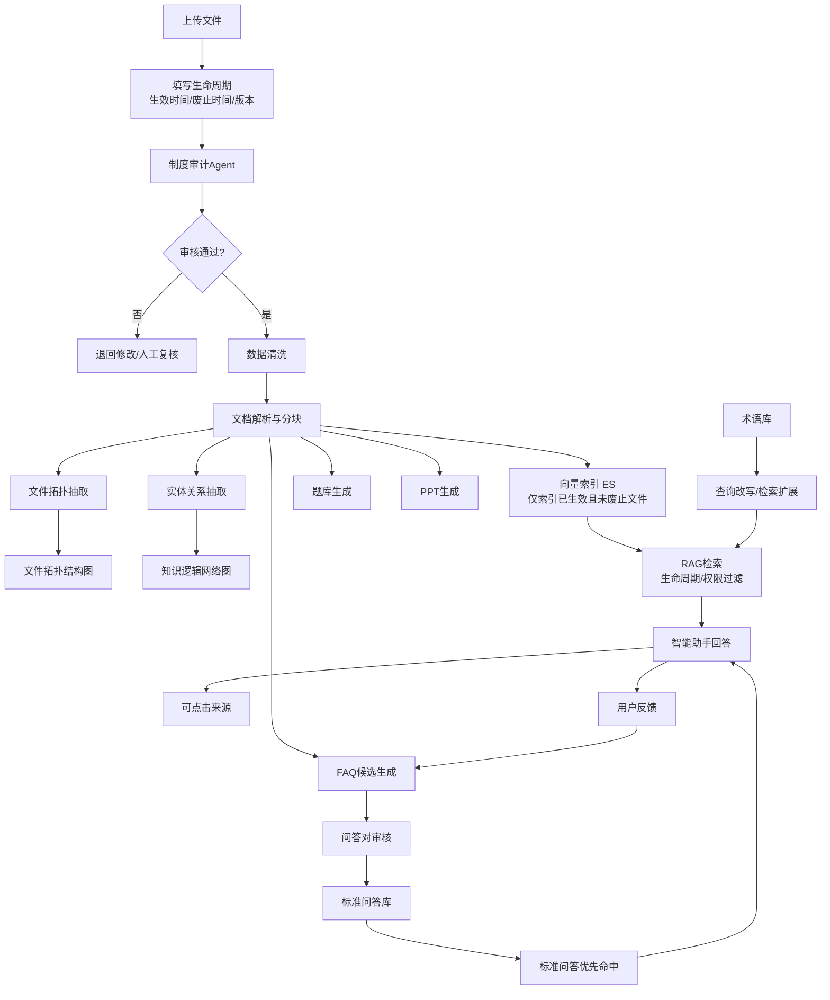
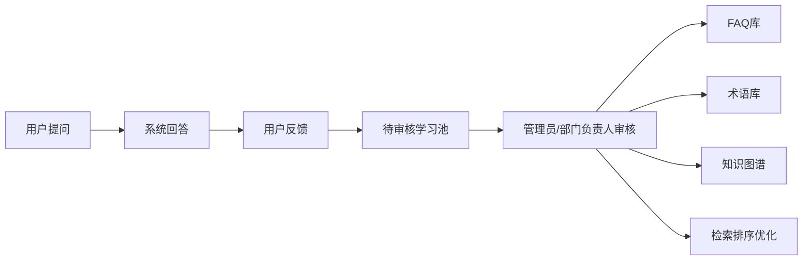
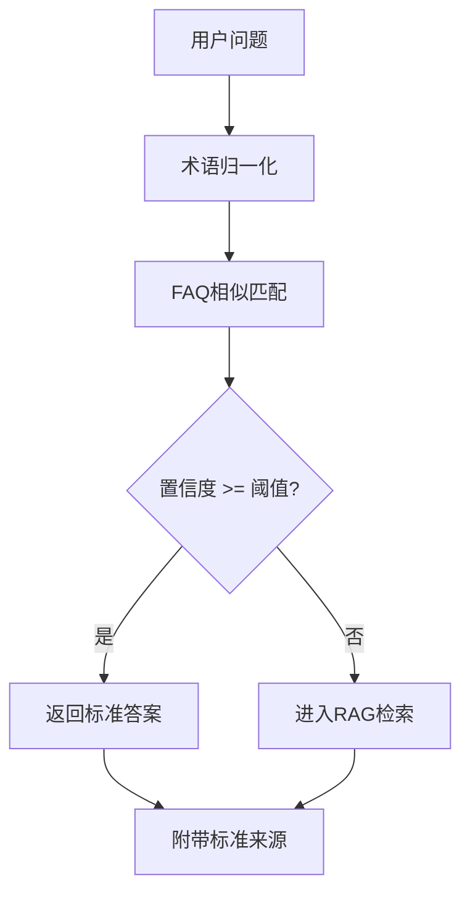
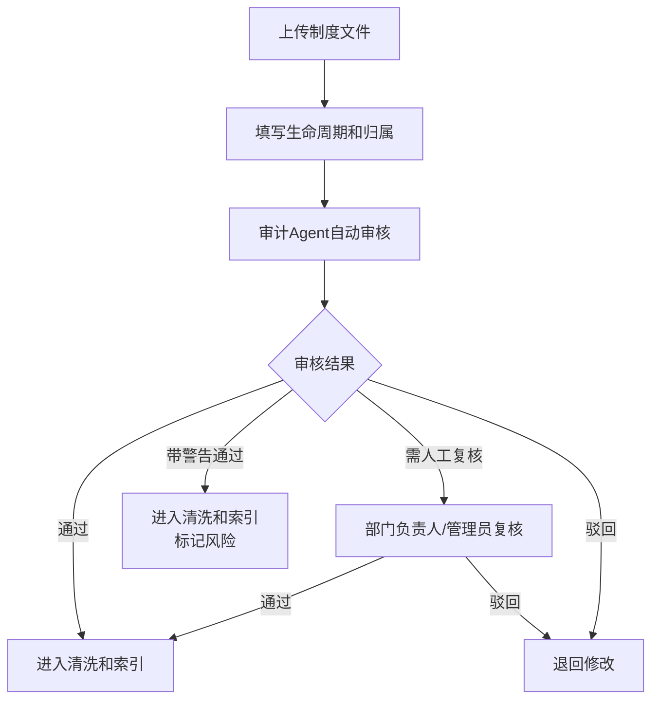

# 龙汇QA智能知识治理与培训增强开发设计文档

版本：v1.0  
日期：2026-06-05  
适用分支：`yxw356/test01:LHRAG`  
目标系统：龙汇QA企业知识库与RAG问答系统

## 1. 背景与目标

当前系统已经具备知识文件上传、知识库分区、数据清洗规则、混合检索、RAG问答、来源引用、对话落库、部门权限和运行监控等基础能力。下一阶段目标不是单点增加按钮，而是把系统升级为“可信问答 + 知识治理 + 培训内容生产 + 持续优化”的企业知识平台。

本次设计覆盖十一项能力：

1. 智能助手回答来源可点击，并可直接查看原文件或原片段。
2. 知识库文件名清晰展示，方便用户浏览、筛选和定位文件。
3. 针对每个知识库分区一键生成培训PPT。
4. 对上传文件做更完整的数据清洗，并基于全部知识生成逻辑网络图。
5. 针对各部门知识库生成培训题库。
6. 增强智能助手的持续学习能力。
7. 增加问答对库，标准问题优先输出标准答案。
8. 增加术语/定义词管理，解决多个表达指向同一业务含义的问题。
9. 增加文件生命周期时间线管理，所有文件具备生效时间、废止时间和状态边界。
10. 增加文件拓扑结构图，展示制度文件之间的引用、替代、依赖和上下位关系。
11. 增加制度审计Agent，审核制度流程是否符合规范，审核通过后才能纳入知识库检索。

## 2. 外部参考

| 方向 | 参考做法 | 对本系统的启发 |
| --- | --- | --- |
| NotebookLM | NotebookLM以用户上传的sources为核心，可以生成报告、学习指南、测验、flashcards、slide decks、mind maps等学习产物，并保留来源关系。参考：NotebookLM创建笔记本说明、sources说明。 | 将“部门知识库”视为企业内部notebook，为每个知识库生成PPT、题库、逻辑图和学习资料。 |
| GraphRAG | Microsoft GraphRAG索引流程会从非结构文本中抽取实体、关系和claims，生成社区摘要，并将文本嵌入向量空间。参考：Microsoft GraphRAG Overview。 | 在现有向量检索之外增加“实体-关系-流程”图谱，用于制度流程梳理和多跳问答。 |
| RAGAS | RAGAS支持基于文档生成合成测试集，用于评估RAG系统。参考：RAGAS Testset Generation。 | 生成题库的同时生成评测集，反过来评估问答准确率和来源命中率。 |
| Elasticsearch Synonym | Elasticsearch synonym token filter支持同义词规则和显式映射。参考：Elasticsearch Synonym Token Filter。 | 建立术语库和同义词库，用于查询改写、检索扩展和标准回答统一。 |

参考链接：

- https://support.google.com/notebooklm/answer/16206563
- https://support.google.com/notebooklm/answer/16215270
- https://microsoft.github.io/graphrag/index/overview/
- https://docs.ragas.io/en/latest/getstarted/rag_testset_generation/
- https://www.elastic.co/guide/en/elasticsearch/reference/current/analysis-synonym-tokenfilter.html

## 3. 总体设计原则

1. 来源可信：所有AI生成内容必须尽量绑定原文件、原片段、页码或段落。
2. 人工可控：术语、标准问答、图谱关系、题库答案允许人工审核和修订。
3. 异步生成：PPT、题库、网络图、全库清洗属于长任务，统一走任务队列和进度状态。
4. 权限继承：所有衍生产物继承知识库分区权限，公共知识、部门知识、个人知识不可越权访问。
5. 可回溯：生成内容记录输入范围、模型版本、提示词版本、生成时间和来源引用。
6. 不直接训练大模型：所谓“自我学习”优先做反馈学习、FAQ沉淀、术语库增强、检索排序优化，避免错误答案污染系统。
7. 生命周期过滤：废止文件、未生效文件、审核未通过文件不进入知识助手检索结果。
8. 审计前置：制度类文件必须先完成合规审计，只有审核通过后才允许索引为可问答知识。

## 4. 总体架构



## 5. 功能设计

### 5.1 智能助手来源可点击

#### 现状

当前前端已存在 `citations` 面板，后端已有 `RetrievalCitation` 和对话落库能力。但来源更多是展示型信息，点击后不能稳定定位到具体文件片段。

#### 目标

回答下方显示“参考来源”，每条来源可点击打开文件预览，并定位到页码、段落或文本片段。

#### 后端改造

将引用对象升级为结构化来源：

| 字段 | 说明 |
| --- | --- |
| `fileMd5` | 文件唯一标识 |
| `fileName` | 文件名 |
| `chunkId` | 文档分块ID |
| `pageNumber` | 页码，无法解析时为空 |
| `sectionTitle` | 章节标题 |
| `snippet` | 命中文本片段 |
| `score` | 检索得分 |
| `retrievalSource` | 来源通道，如 keyword/vector/faq/graph |
| `previewUrl` | 文件预览接口地址 |

新增接口：

| 接口 | 方法 | 用途 |
| --- | --- | --- |
| `/api/v1/documents/{fileMd5}/preview` | GET | 预览文件 |
| `/api/v1/documents/{fileMd5}/chunks/{chunkId}` | GET | 获取命中片段上下文 |
| `/api/v1/documents/{fileMd5}/locate` | GET | 按页码或片段定位 |

#### 前端改造

1. 聊天来源区默认收起，只显示“参考来源 N 条”。
2. 展开后展示文件名、页码、片段、得分。
3. 点击来源打开文件预览弹窗。
4. 如果文件类型不支持精确页码定位，则退化为展示文本片段。

#### 验收标准

1. 回答来源可点击。
2. 点击后能看到文件名和片段。
3. 不同权限用户不能打开无权限文件。
4. 对话历史中仍能恢复来源信息。

### 5.2 知识库文件名清晰展示

#### 目标

知识库页面按分区展示时，用户能清楚看到每个分区下有哪些文件。

#### 前端改造

1. 分区块增加“最近文件”小列表，显示最多3个文件名。
2. 文件表固定展示文件名、知识类型、所属部门、分类、清洗状态、索引状态。
3. 文件名列支持悬浮查看完整名称。
4. 文件名支持点击预览。
5. 空分区展示“暂无文件”，避免用户误以为加载失败。

#### 后端改造

`/documents/knowledge-spaces` 返回每个分区的最近文件摘要：

```json
{
  "id": "department:hr",
  "title": "人事行政部知识库",
  "fileCount": 12,
  "recentFiles": [
    {
      "fileMd5": "...",
      "fileName": "员工手册.pdf",
      "updatedAt": "2026-06-05 10:20:00"
    }
  ]
}
```

### 5.3 部门知识库一键生成PPT

#### 目标

部门负责人或管理员可以针对某个知识库分区生成培训PPT，适合部门培训、制度宣贯和新人学习。

#### 生成流程

1. 用户选择知识库分区。
2. 系统读取该分区可访问文档。
3. LLM生成培训大纲。
4. LLM按大纲生成每页标题、要点、讲解备注和来源。
5. 后端使用PPTX生成库生成文件。
6. 生成结果保存为知识产物，支持下载和重新生成。

#### PPT结构

| 页类型 | 内容 |
| --- | --- |
| 封面 | 部门名称、主题、生成日期 |
| 学习目标 | 本次培训要掌握的制度或流程 |
| 知识框架 | 该部门知识结构 |
| 核心制度 | 重点制度条款 |
| 流程说明 | 关键流程步骤 |
| 常见问题 | 高频问答 |
| 测验页 | 3-5道题 |
| 来源页 | 引用文件列表 |

#### 权限

| 角色 | 权限 |
| --- | --- |
| 超级管理员 | 可为任意知识库生成PPT |
| 部门负责人 | 可为本部门知识库生成PPT |
| 普通成员 | 可查看有权限的已发布PPT |

### 5.4 数据清洗与逻辑网络图

#### 数据清洗升级

现有系统已有清洗规则。下一步增加“清洗流水线”概念：

| 步骤 | 说明 |
| --- | --- |
| 格式清洗 | 去页眉页脚、目录噪音、水印、重复空行 |
| 结构识别 | 识别标题、章节、表格、条款、流程步骤 |
| 术语归一 | 调用术语库，把同义表达映射为标准词 |
| 质量评分 | 评估文本完整性、乱码率、重复率、可检索性 |
| 版本识别 | 识别制度版本、发布日期、生效日期 |

#### 逻辑网络图

系统从清洗后的知识中抽取实体和关系，形成可视化网络图。

实体类型：

| 类型 | 示例 |
| --- | --- |
| 制度 | 考勤制度、报销制度 |
| 流程 | 请假流程、入职流程 |
| 部门 | 人事行政部、财务部 |
| 岗位 | 部门负责人、员工、管理员 |
| 动作 | 提交、审批、归档 |
| 条件 | 三天以上、试用期、跨部门 |
| 材料 | 发票、申请表、合同 |

关系类型：

| 类型 | 示例 |
| --- | --- |
| `APPLIES_TO` | 制度适用于某部门或角色 |
| `APPROVED_BY` | 流程由某角色审批 |
| `REQUIRES` | 流程需要某材料 |
| `PRECEDES` | 步骤A先于步骤B |
| `EXCEPTION_OF` | 某条款是例外规则 |
| `REPLACES` | 新制度替代旧制度 |
| `RELATED_TO` | 两个知识点相关 |

#### 展示方式

1. 按知识库分区查看网络图。
2. 支持搜索实体。
3. 点击节点展示关联文件和原文片段。
4. 支持从节点发起聊天，例如“解释这个流程”。
5. 支持人工确认、删除、合并实体关系。

### 5.5 部门题库生成

#### 目标

针对部门知识库生成培训题库，便于新员工学习、制度考试和培训验收。

#### 题型

| 题型 | 说明 |
| --- | --- |
| 单选题 | 适合制度条款、标准流程 |
| 多选题 | 适合职责、材料、例外条件 |
| 判断题 | 适合快速检查基础理解 |
| 简答题 | 适合流程解释和场景判断 |
| 情景题 | 适合复杂业务制度 |

#### 题目字段

| 字段 | 说明 |
| --- | --- |
| `questionText` | 题干 |
| `questionType` | 题型 |
| `options` | 选项 |
| `answer` | 标准答案 |
| `explanation` | 解析 |
| `difficulty` | easy/medium/hard |
| `departmentId` | 部门 |
| `spaceId` | 知识库分区 |
| `sourceFileMd5` | 来源文件 |
| `sourceChunkId` | 来源片段 |
| `status` | 草稿、已发布、已停用 |

#### 生成策略

1. 每个文档至少生成基础题。
2. 重点制度生成更多题。
3. 题目必须带来源。
4. 题目先进入草稿，由部门负责人审核发布。
5. 支持导出Excel或作为在线考试题库。

### 5.6 智能助手持续学习

#### 设计边界

不做“自动训练大模型”。企业知识库需要可控、可审计、可回滚，因此采用反馈学习闭环。

#### 学习来源

| 来源 | 用途 |
| --- | --- |
| 用户点赞/点踩 | 判断回答质量 |
| 用户追问 | 发现回答不完整的问题 |
| 人工改写答案 | 形成FAQ候选 |
| 无答案问题 | 形成知识缺口 |
| 高频问题 | 形成标准问答 |
| 术语纠正 | 更新术语库 |

#### 学习闭环



#### 反馈类型

| 类型 | 说明 |
| --- | --- |
| 采纳 | 用户认为答案可用 |
| 不准确 | 答案有错 |
| 来源不对 | 引用文件不匹配 |
| 缺少内容 | 没有覆盖关键点 |
| 人工修正 | 用户提交正确答案 |

### 5.7 问答对库

#### 目标

标准问题直接输出标准答案，减少大模型不稳定性。

#### 命中链路



#### 数据模型

| 字段 | 说明 |
| --- | --- |
| `standardQuestion` | 标准问题 |
| `similarQuestions` | 相似问法 |
| `answer` | 标准答案 |
| `sourceFileMd5` | 来源文件 |
| `sourceChunkId` | 来源片段 |
| `spaceId` | 所属知识库 |
| `departmentId` | 所属部门 |
| `enabled` | 是否启用 |
| `hitCount` | 命中次数 |
| `lastReviewedAt` | 最近审核时间 |

#### 管理能力

1. 手工新增问答对。
2. 从用户反馈生成候选问答对。
3. 从高频问题生成候选问答对。
4. 支持审核、发布、停用。
5. 支持按部门授权。

### 5.8 术语/定义词管理

#### 目标

解决“多个表达实际指向同一含义”的问题，并开放人工干预入口。

#### 示例

| 标准词 | 同义词 | 解释 |
| --- | --- | --- |
| 绩效考核 | KPI考核、绩效评估、考评 | 公司对员工阶段性表现的评价流程 |
| 请假申请 | 休假申请、假期申请、请假流程 | 员工申请假期的标准流程 |
| 部门负责人 | 部门经理、主管、负责人 | 部门知识和成员管理角色 |

#### 数据模型

| 字段 | 说明 |
| --- | --- |
| `term` | 标准词 |
| `aliases` | 同义词列表 |
| `definition` | 定义 |
| `departmentId` | 适用部门，可为空 |
| `spaceId` | 适用知识库，可为空 |
| `enabled` | 是否启用 |
| `createdBy` | 创建人 |
| `reviewStatus` | 待审核、已通过、已拒绝 |

#### 使用位置

| 环节 | 用法 |
| --- | --- |
| 用户提问 | 查询改写，把同义词扩展为标准词 |
| 检索 | 扩展关键词召回 |
| FAQ匹配 | 提升标准问题命中率 |
| 图谱抽取 | 合并同义实体 |
| 回答生成 | 使用统一术语输出 |

### 5.9 文件生命周期时间线管理

#### 目标

所有知识文件必须具备清晰的时间边界，包括生效时间、废止时间、版本号和生命周期状态。知识助手只能检索“已审核通过、已生效、未废止”的文件，避免废止制度继续影响回答。

#### 生命周期状态

| 状态 | 说明 | 是否可被知识助手检索 |
| --- | --- | --- |
| `DRAFT` | 草稿，刚上传或待补充信息 | 否 |
| `PENDING_AUDIT` | 待制度审计Agent审核 | 否 |
| `AUDIT_REJECTED` | 审计不通过，需修改 | 否 |
| `APPROVED` | 审计通过，但可能未到生效时间 | 到达生效时间后可检索 |
| `ACTIVE` | 当前有效文件 | 是 |
| `EXPIRED` | 超过废止时间自动失效 | 否 |
| `REVOKED` | 人工废止 | 否 |
| `SUPERSEDED` | 被新版本替代 | 否，除非用户明确查询历史制度 |

#### 文件时间线字段

| 字段 | 说明 |
| --- | --- |
| `effectiveAt` | 生效时间 |
| `abolishedAt` | 废止时间，可为空 |
| `publishedAt` | 发布或批准时间 |
| `versionNo` | 制度版本号 |
| `supersedesFileMd5` | 替代的旧文件 |
| `supersededByFileMd5` | 被哪个新文件替代 |
| `lifecycleStatus` | 生命周期状态 |
| `auditStatus` | 审计状态 |

#### 检索过滤规则

知识助手检索时必须增加过滤条件：

1. `auditStatus = APPROVED`。
2. `effectiveAt <= 当前时间`。
3. `abolishedAt 为空或 abolishedAt > 当前时间`。
4. `lifecycleStatus = ACTIVE`。
5. 权限范围仍然满足部门、角色和可见范围规则。

如果用户明确询问“历史制度”“旧版制度”“某年某月适用的制度”，系统可以进入历史查询模式，但回答必须明确提示“这是历史/废止制度，不代表当前有效规则”。

#### 页面设计

1. 文件表增加“生效时间”“废止时间”“生命周期状态”“版本号”列。
2. 文件详情增加“时间线”视图，展示上传、审计、发布、生效、废止、替代记录。
3. 知识库分区增加“当前有效文件数”“即将废止文件数”“待审核文件数”。
4. 上传弹窗强制填写生效时间，废止时间可选。
5. 文件废止后保留历史记录，但默认不进入检索。

### 5.10 文件拓扑结构图

#### 目标

在逻辑网络图之外，增加“文件级拓扑结构图”，用于展示制度文件之间的关系，帮助用户理解哪些文件是上位制度、哪些文件是实施细则、哪些文件已经被替代或引用。

#### 拓扑关系类型

| 关系 | 说明 | 示例 |
| --- | --- | --- |
| `REFERENCES` | 文件引用另一个文件 | 报销细则引用财务制度 |
| `IMPLEMENTS` | 文件是某制度的实施细则 | 差旅报销细则实施财务制度 |
| `SUPERSEDES` | 新文件替代旧文件 | 2026版员工手册替代2025版 |
| `DEPENDS_ON` | 文件执行依赖另一文件 | 考勤办法依赖人事管理制度 |
| `CONFLICTS_WITH` | 文件存在冲突 | 新旧制度条款冲突 |
| `BELONGS_TO` | 文件归属某制度体系 | 请假流程属于人事制度体系 |
| `SUPPORTS` | 文件是补充材料 | 表单模板支持报销流程 |

#### 抽取方式

1. 规则抽取：识别“依据”“参照”“见”“按照”“替代”“废止”等关键词。
2. 元数据抽取：根据版本号、生效时间、废止时间、标题相似度识别替代关系。
3. LLM抽取：从正文中抽取文件间关系和冲突点。
4. 人工审核：关系必须可编辑、可确认、可驳回。

#### 展示方式

1. 节点是文件，边是文件关系。
2. 节点颜色体现生命周期状态：有效、待审核、废止、被替代。
3. 点击文件节点展示文件详情、来源片段、关联问答、生成题库和PPT入口。
4. 支持按部门、知识库分区、制度体系过滤。
5. 支持一键查看“某文件影响了哪些制度流程”。

#### 与知识助手的关系

文件拓扑用于辅助回答：

1. 用户问当前制度时，只使用有效节点。
2. 用户问制度沿革时，使用拓扑中的替代关系。
3. 用户问制度冲突时，优先展示 `CONFLICTS_WITH` 关系和审计Agent发现的问题。

### 5.11 制度审计Agent

#### 目标

新增审计Agent，在文件进入正式知识库前审核制度流程是否符合规范。只有审计通过的制度类文件才能被索引进知识助手。

#### 审计对象

| 文件类型 | 是否必须审计 |
| --- | --- |
| 公司制度 | 必须 |
| 部门制度 | 必须 |
| 流程规范 | 必须 |
| 操作手册 | 建议 |
| 培训材料 | 建议 |
| 普通资料 | 可选 |

#### 审计维度

| 维度 | 检查内容 |
| --- | --- |
| 完整性 | 是否包含适用范围、责任部门、生效时间、审批人、版本号 |
| 一致性 | 是否与现有有效制度冲突 |
| 时效性 | 生效时间、废止时间、版本关系是否清晰 |
| 权责清晰 | 是否明确责任岗位、审批流程和执行部门 |
| 流程闭环 | 是否包含提交、审批、执行、归档、异常处理 |
| 合规措辞 | 是否存在明显不规范、歧义或无法执行的条款 |
| 来源依据 | 是否说明依据或上位制度 |
| 可问答性 | 文档结构是否适合解析和检索 |

#### 审计结果

| 结果 | 处理 |
| --- | --- |
| `PASS` | 进入清洗、分块、索引流程 |
| `PASS_WITH_WARNINGS` | 可入库，但标记风险项，需后续人工复核 |
| `REJECT` | 不入库，退回修改 |
| `NEED_MANUAL_REVIEW` | 进入人工审核队列 |

#### 审计输出

```json
{
  "auditStatus": "NEED_MANUAL_REVIEW",
  "score": 78,
  "summary": "制度结构基本完整，但缺少废止时间和异常处理流程。",
  "issues": [
    {
      "severity": "HIGH",
      "dimension": "流程闭环",
      "message": "请假流程缺少审批驳回后的处理说明",
      "sourceSnippet": "员工提交申请后由部门负责人审批"
    }
  ],
  "suggestions": [
    "补充审批驳回后的修改和重新提交流程",
    "补充该制度替代或废止的旧版本文件"
  ]
}
```

#### 审计流程



#### 权限

1. 部门负责人可以审核本部门制度。
2. 超级管理员可以审核所有制度。
3. 普通成员只能查看已发布且有权限的审计结果摘要。
4. 审计未通过文件不可被知识助手检索，也不可生成PPT和题库。

## 6. 新增后端模块

| 模块 | 说明 |
| --- | --- |
| `CitationService` | 结构化来源、预览定位 |
| `KnowledgeArtifactService` | PPT、题库、网络图等知识产物管理 |
| `TrainingDeckService` | PPT生成 |
| `QuestionBankService` | 题库生成与管理 |
| `KnowledgeGraphService` | 实体关系抽取、图谱查询 |
| `FaqService` | 问答对命中、审核、管理 |
| `TermDictionaryService` | 术语库、同义词库 |
| `LearningFeedbackService` | 用户反馈与学习候选池 |
| `GenerationTaskService` | 异步生成任务、进度、失败重试 |
| `DocumentLifecycleService` | 文件生效、废止、替代、历史版本管理 |
| `DocumentTopologyService` | 文件级拓扑关系抽取、查询、审核 |
| `PolicyAuditAgentService` | 制度审计Agent，输出合规评分、风险项和处理建议 |

## 7. 新增前端页面

| 页面 | 路由建议 | 说明 |
| --- | --- | --- |
| 来源预览弹窗 | 复用知识库文件预览 | 聊天来源点击后打开 |
| 知识产物中心 | `/knowledge-artifacts` | 查看PPT、题库、网络图 |
| 题库管理 | `/question-bank` | 部门题库生成、审核、导出 |
| 术语中心 | `/terms` | 标准词、同义词、定义管理 |
| 问答对管理 | `/faq` | 标准问答管理 |
| 知识图谱 | `/knowledge-graph` | 网络图查看、编辑、审核 |
| 学习反馈池 | `/learning-feedback` | 点踩、修正、无答案问题审核 |
| 文件时间线 | 文件详情内嵌 | 查看生效、废止、替代、审计、索引历史 |
| 文件拓扑图 | `/document-topology` | 查看文件之间的引用、替代、依赖和冲突关系 |
| 制度审计中心 | `/policy-audit` | 审核Agent结果、人工复核、驳回修改 |

## 8. 数据表设计草案

### 8.1 `knowledge_artifact`

| 字段 | 类型 | 说明 |
| --- | --- | --- |
| `id` | bigint | 主键 |
| `artifact_type` | varchar | PPT/QUESTION_BANK/GRAPH/STUDY_GUIDE |
| `title` | varchar | 标题 |
| `space_id` | varchar | 知识库分区 |
| `department_id` | varchar | 部门 |
| `file_md5` | varchar | 关联文件，可为空 |
| `storage_path` | varchar | 生成文件存储路径 |
| `status` | varchar | GENERATING/SUCCESS/FAILED |
| `source_snapshot` | text | 来源快照 |
| `created_by` | varchar | 创建人 |
| `created_at` | datetime | 创建时间 |

### 8.2 `training_question`

| 字段 | 类型 | 说明 |
| --- | --- | --- |
| `id` | bigint | 主键 |
| `question_type` | varchar | SINGLE/MULTIPLE/JUDGE/SHORT/SCENARIO |
| `question_text` | text | 题干 |
| `options_json` | text | 选项 |
| `answer` | text | 标准答案 |
| `explanation` | text | 解析 |
| `difficulty` | varchar | EASY/MEDIUM/HARD |
| `space_id` | varchar | 知识库分区 |
| `department_id` | varchar | 部门 |
| `source_file_md5` | varchar | 来源文件 |
| `source_chunk_id` | varchar | 来源片段 |
| `status` | varchar | DRAFT/PUBLISHED/DISABLED |

### 8.3 `faq_entry`

| 字段 | 类型 | 说明 |
| --- | --- | --- |
| `id` | bigint | 主键 |
| `standard_question` | text | 标准问题 |
| `similar_questions_json` | text | 相似问法 |
| `answer` | text | 标准答案 |
| `space_id` | varchar | 知识库分区 |
| `department_id` | varchar | 部门 |
| `source_file_md5` | varchar | 来源文件 |
| `source_chunk_id` | varchar | 来源片段 |
| `enabled` | boolean | 是否启用 |
| `hit_count` | bigint | 命中次数 |

### 8.4 `term_entry`

| 字段 | 类型 | 说明 |
| --- | --- | --- |
| `id` | bigint | 主键 |
| `term` | varchar | 标准词 |
| `aliases_json` | text | 同义词 |
| `definition` | text | 定义 |
| `space_id` | varchar | 适用知识库 |
| `department_id` | varchar | 适用部门 |
| `review_status` | varchar | PENDING/APPROVED/REJECTED |
| `enabled` | boolean | 是否启用 |

### 8.5 `knowledge_graph_node`

| 字段 | 类型 | 说明 |
| --- | --- | --- |
| `id` | bigint | 主键 |
| `node_key` | varchar | 节点唯一键 |
| `node_type` | varchar | 制度/流程/部门/岗位/动作/条件 |
| `name` | varchar | 节点名称 |
| `description` | text | 描述 |
| `space_id` | varchar | 知识库分区 |
| `source_refs_json` | text | 来源引用 |

### 8.6 `knowledge_graph_edge`

| 字段 | 类型 | 说明 |
| --- | --- | --- |
| `id` | bigint | 主键 |
| `source_node_key` | varchar | 起点 |
| `target_node_key` | varchar | 终点 |
| `relation_type` | varchar | 关系类型 |
| `confidence` | decimal | 置信度 |
| `source_refs_json` | text | 来源引用 |
| `review_status` | varchar | 待审核/已通过/已拒绝 |

### 8.7 `learning_feedback`

| 字段 | 类型 | 说明 |
| --- | --- | --- |
| `id` | bigint | 主键 |
| `conversation_id` | varchar | 对话ID |
| `question` | text | 用户问题 |
| `answer` | text | 系统回答 |
| `feedback_type` | varchar | 采纳/不准确/来源不对/缺少内容 |
| `corrected_answer` | text | 人工修正 |
| `status` | varchar | 待处理/已转FAQ/已忽略 |
| `created_by` | varchar | 反馈人 |

### 8.8 `document_lifecycle`

| 字段 | 类型 | 说明 |
| --- | --- | --- |
| `id` | bigint | 主键 |
| `file_md5` | varchar | 文件唯一标识 |
| `version_no` | varchar | 版本号 |
| `effective_at` | datetime | 生效时间 |
| `abolished_at` | datetime | 废止时间 |
| `published_at` | datetime | 发布/批准时间 |
| `lifecycle_status` | varchar | DRAFT/PENDING_AUDIT/APPROVED/ACTIVE/EXPIRED/REVOKED/SUPERSEDED |
| `supersedes_file_md5` | varchar | 替代的旧文件 |
| `superseded_by_file_md5` | varchar | 被哪个新文件替代 |
| `changed_by` | varchar | 操作人 |
| `change_reason` | text | 变更原因 |

### 8.9 `document_topology_edge`

| 字段 | 类型 | 说明 |
| --- | --- | --- |
| `id` | bigint | 主键 |
| `source_file_md5` | varchar | 起点文件 |
| `target_file_md5` | varchar | 终点文件 |
| `relation_type` | varchar | REFERENCES/IMPLEMENTS/SUPERSEDES/DEPENDS_ON/CONFLICTS_WITH/BELONGS_TO/SUPPORTS |
| `confidence` | decimal | 置信度 |
| `evidence_snippet` | text | 关系证据片段 |
| `review_status` | varchar | PENDING/APPROVED/REJECTED |
| `created_by` | varchar | 创建来源，Agent或人工 |

### 8.10 `policy_audit_report`

| 字段 | 类型 | 说明 |
| --- | --- | --- |
| `id` | bigint | 主键 |
| `file_md5` | varchar | 文件唯一标识 |
| `audit_status` | varchar | PASS/PASS_WITH_WARNINGS/REJECT/NEED_MANUAL_REVIEW |
| `score` | decimal | 审计评分 |
| `summary` | text | 总结 |
| `issues_json` | text | 风险项 |
| `suggestions_json` | text | 修改建议 |
| `auditor_type` | varchar | AGENT/HUMAN |
| `reviewed_by` | varchar | 人工复核人 |
| `reviewed_at` | datetime | 复核时间 |

## 9. 核心接口草案

| 接口 | 方法 | 用途 |
| --- | --- | --- |
| `/api/v1/documents/{fileMd5}/preview` | GET | 文件预览 |
| `/api/v1/documents/{fileMd5}/chunks/{chunkId}` | GET | 来源片段定位 |
| `/api/v1/artifacts` | GET | 知识产物列表 |
| `/api/v1/artifacts/ppt/generate` | POST | 生成PPT |
| `/api/v1/question-bank/generate` | POST | 生成题库 |
| `/api/v1/question-bank` | GET | 题库列表 |
| `/api/v1/knowledge-graph/generate` | POST | 生成逻辑网络图 |
| `/api/v1/knowledge-graph` | GET | 查询图谱 |
| `/api/v1/faqs` | GET/POST | 问答对管理 |
| `/api/v1/terms` | GET/POST | 术语管理 |
| `/api/v1/learning-feedback` | GET/POST | 反馈学习池 |
| `/api/v1/documents/{fileMd5}/lifecycle` | GET/PUT | 文件生命周期查看和更新 |
| `/api/v1/documents/{fileMd5}/timeline` | GET | 文件时间线 |
| `/api/v1/document-topology` | GET | 文件拓扑图查询 |
| `/api/v1/document-topology/generate` | POST | 生成文件拓扑关系 |
| `/api/v1/document-topology/{edgeId}/review` | POST | 审核文件关系 |
| `/api/v1/policy-audit/{fileMd5}` | GET | 查看制度审计结果 |
| `/api/v1/policy-audit/{fileMd5}/run` | POST | 触发审计Agent |
| `/api/v1/policy-audit/{fileMd5}/review` | POST | 人工复核审计结果 |

## 10. 权限设计

| 功能 | 超级管理员 | 部门负责人 | 普通成员 |
| --- | --- | --- | --- |
| 查看来源 | 全部 | 本部门和授权范围 | 授权范围 |
| 生成PPT | 全部 | 本部门 | 无 |
| 查看PPT | 全部 | 本部门 | 已发布且有权限 |
| 生成题库 | 全部 | 本部门 | 无 |
| 发布题库 | 全部 | 本部门 | 无 |
| 生成图谱 | 全部 | 本部门 | 无 |
| 审核图谱关系 | 全部 | 本部门 | 无 |
| 管理FAQ | 全部 | 本部门 | 无 |
| 管理术语 | 全部 | 本部门 | 可提交候选 |
| 提交反馈 | 可以 | 可以 | 可以 |
| 管理文件生效/废止时间 | 全部 | 本部门 | 无 |
| 查看文件时间线 | 全部 | 本部门和授权范围 | 授权范围 |
| 生成文件拓扑图 | 全部 | 本部门 | 无 |
| 审核文件拓扑关系 | 全部 | 本部门 | 无 |
| 运行制度审计Agent | 全部 | 本部门 | 无 |
| 复核制度审计结果 | 全部 | 本部门 | 无 |

## 11. 实施阶段

### 阶段一：可信问答基础增强

目标：让问答更可信、更稳定。

交付：

1. 文件生命周期字段和时间线管理。
2. 制度审计Agent基础版，审核通过后才能索引。
3. 检索链路过滤废止、未生效、审核未通过文件。
4. 来源可点击。
5. 文件名清晰展示。
6. FAQ问答对管理。
7. 术语/定义词管理。
8. FAQ优先命中链路。
9. 术语参与查询改写。

验收：

1. 废止文件不会出现在知识助手默认检索结果中。
2. 审计未通过文件不会被索引为可问答知识。
3. 标准问题命中FAQ时不调用大模型或仅调用大模型做补充。
4. 来源点击可打开文件或片段。
5. 术语同义词能影响检索结果。

### 阶段二：培训内容生产

目标：让部门负责人能基于知识库快速生成培训资料。

交付：

1. PPT生成任务。
2. 部门题库生成。
3. 题库审核与发布。
4. PPT下载。
5. 生成任务进度展示。

验收：

1. 每份PPT带来源页。
2. 每道题带答案、解析和来源。
3. 生成失败可重试。

### 阶段三：知识治理与逻辑网络图

目标：把制度、流程、岗位、部门、文件版本和文件关系可视化。

交付：

1. 清洗流水线升级。
2. 实体关系抽取。
3. 网络图展示。
4. 节点点击查看来源。
5. 人工审核与合并节点。
6. 文件拓扑结构图。
7. 文件引用、替代、依赖、冲突关系审核。

验收：

1. 能按部门生成网络图。
2. 节点和边都有来源。
3. 支持从图谱节点发起问答。
4. 能看到文件之间的引用、替代、依赖和冲突关系。
5. 新版本替代旧版本后，旧文件自动退出默认检索范围。

### 阶段四：持续学习闭环

目标：让系统在人工可控前提下越来越准。

交付：

1. 回答点赞/点踩。
2. 人工修正答案。
3. 学习反馈池。
4. FAQ候选自动生成。
5. 术语候选自动生成。

验收：

1. 用户反馈能进入审核池。
2. 审核通过后能进入FAQ或术语库。
3. 低质量回答可追踪到问题原因。

### 阶段五：评测中心

目标：建立系统质量评估能力。

交付：

1. 自动生成RAG测试集。
2. 评估问答准确率。
3. 评估来源命中率。
4. 评估FAQ命中率。
5. 输出低分问题清单。

验收：

1. 每个知识库分区可生成一套评测集。
2. 每次模型或检索策略调整后可对比指标变化。

## 12. 技术风险与处理

| 风险 | 说明 | 处理方式 |
| --- | --- | --- |
| 来源定位不准 | PDF、Word页码和文本片段不一定稳定 | 优先片段定位，页码作为辅助 |
| AI生成内容不可靠 | PPT、题库、图谱可能有幻觉 | 所有生成内容必须带来源和审核状态 |
| 自学习污染系统 | 错误反馈可能进入知识库 | 必须人工审核后才能进入FAQ/术语/图谱 |
| 生成任务耗时 | PPT、图谱、题库生成可能较慢 | 异步任务、进度、失败重试 |
| 权限越界 | 衍生产物可能泄露部门知识 | 产物继承知识库权限，并在接口层二次校验 |
| 图谱太复杂 | 节点过多影响理解 | 按部门、主题、流程分层展示 |
| 废止边界不清 | 用户可能问到历史制度 | 默认只答当前有效制度，历史查询必须明确标注时间范围和废止状态 |
| 审计Agent误判 | Agent可能误判制度合规性 | 高风险项进入人工复核，审计结果保留证据片段 |
| 文件拓扑关系错误 | LLM抽取的引用或替代关系可能不准 | 所有拓扑边带置信度和审核状态，默认仅使用已审核关系 |

## 13. 测试策略

| 类型 | 测试内容 |
| --- | --- |
| 单元测试 | FAQ匹配、术语归一、权限判断、来源对象构造 |
| 集成测试 | PPT生成任务、题库生成任务、图谱生成任务 |
| 权限测试 | 不同角色访问来源、PPT、题库、图谱 |
| 前端测试 | 来源点击、文件预览、生成任务进度、图谱交互 |
| RAG评测 | 标准问答命中率、检索召回率、来源准确率 |
| 压测 | 20-50人同时问答、生成任务排队、上传并发 |
| 生命周期测试 | 生效前、有效期内、废止后、被替代后的检索过滤 |
| 审计测试 | 审计通过、带警告通过、驳回、人工复核流程 |
| 拓扑测试 | 文件引用、替代、冲突关系抽取和审核 |

## 14. 推荐优先级

建议优先做阶段一。原因是它直接提升日常问答体验，并先建立“可检索知识准入门槛”。没有生命周期和审计准入，后续PPT、题库、图谱和自学习都可能引用过期或不合规制度。

第一批开发顺序：

1. 文件生命周期字段、时间线和状态流转。
2. 审计Agent基础版和人工复核入口。
3. 检索过滤废止、未生效、审核未通过文件。
4. 来源可点击。
5. 知识库文件名展示优化。
6. FAQ问答对表和管理页。
7. 术语库表和管理页。
8. FAQ + 术语接入聊天链路。

第二批开发顺序：

1. PPT生成。
2. 题库生成。
3. 生成任务中心。

第三批开发顺序：

1. 清洗流水线升级。
2. 实体关系抽取。
3. 文件拓扑结构图。
4. 逻辑网络图。
5. 学习反馈池。

## 15. 结论

本方案的核心不是让大模型“随便发挥”，而是通过来源、生命周期、审计准入、FAQ、术语、图谱、题库和反馈审核，把企业知识变成可检索、可培训、可追溯、可持续优化的知识资产。

落地时应先建立“有效文件 + 审计通过”的准入机制，再增强可信问答基础，然后做培训内容生成，最后做文件拓扑、知识图谱和持续学习闭环。这样风险最小、收益最快，也最符合当前系统已有架构。
